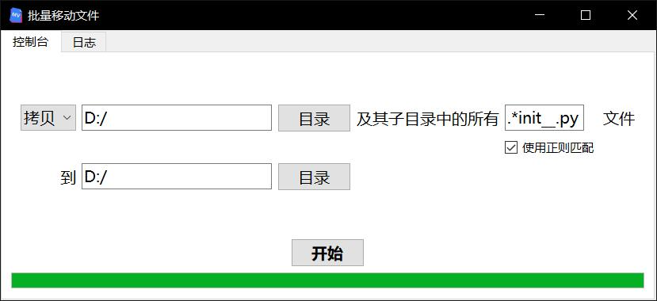
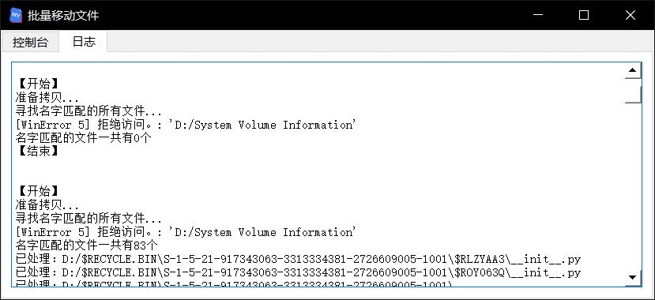

# move_files

一个基于PyQt5的软件，用于批量移动/拷贝文件。

## 预览图

## 使用规则

移动（或拷贝）A目录及其子目录下的所有X文件，到B目录。

- X是不包含路径的文件名，可以使用通配符或正则表达式进行匹配。
- 如果有多个相同名字的文件被移动（或拷贝）到B目录，则后来的文件会把先来的文件覆盖。

## 使用技巧

- 在磁盘中，移动文件比拷贝文件的速度更快。
- 运行时产生的信息和错误都会打印到日志窗口。

[下载发布版](https://github.com/LeoHsiao1/move_files/releases/download/v1.0.0/release.zip)